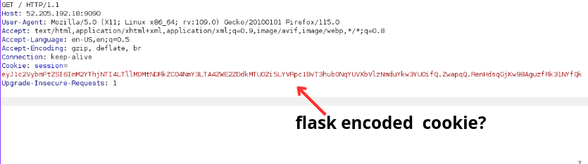
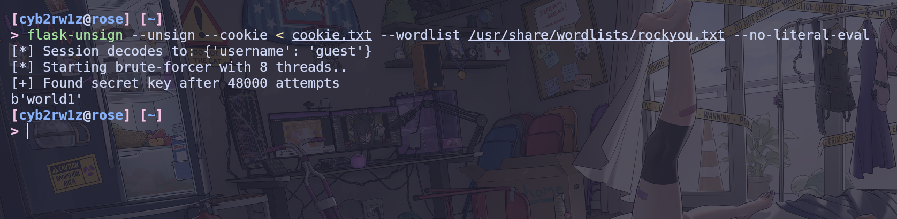
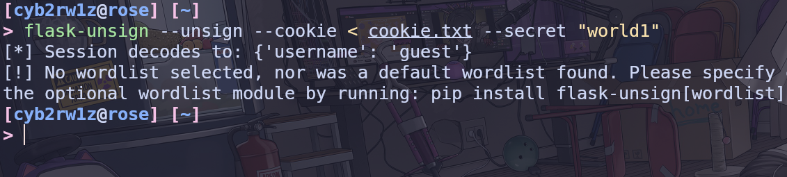
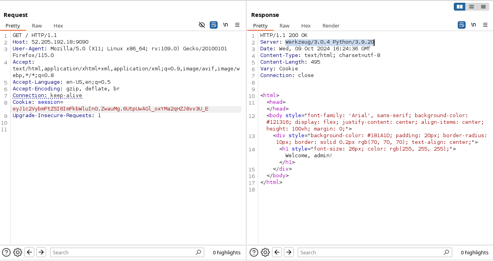
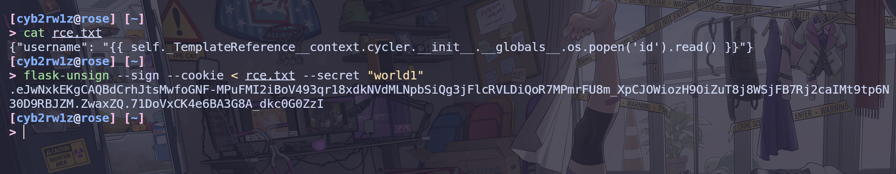
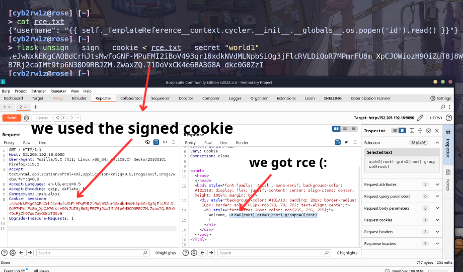

# Easy challenge tbh
First off spin up burpsuite, then request to the given IP, youll notice a session cookie. This cookie appears to be flask encoded values. to figure out what theyre we'll need to brute force a secret word used to generate such cookie.



Now get you hands on flask-unsign (also based on the challenge name duh) and download it and make sure you got rockyou list.

Now copy the value of the cookie, and store it in a file called cookie.txt or anything you want.

```sh
echo "eyJ1c2VybmFtZSI6ImM2YThjNTI4LTllMDMtNDRkZC04NmY3LTA4ZWE2ZDdkMTU0Zi5LYVRpc1BvT3hub0NqYUVXbVlzNmduYkw3YU0ifQ.ZwapqQ.RenHdsqGjKw98AguzfRk31NYfQk" > cookie.txt
```

Now make sure you downloaded flask-unsign, and BRUTTEE FORCE ITT!!!!
```sh
flask-unsign --unsign --cookie < cookie.txt --wordlist /usr/share/wordlists/rockyou.txt
```
also if you get stack trace or any other errors use this command 
```
flask-unsign --unsign --cookie < cookie.txt --wordlist /usr/share/wordlists/rockyou.txt --no-literal-eval
```
itll prevent the tool from interpreting any non-string values as integers and treat everything as a string.

let it cook for a while until you get this.


this means the word world1 is used to encode the values in the session, we can further decode to see them.



Okay the cookie represents {'username': 'guest'} so we can change the values instead of guest we can set admin or any other user and sign it back using the world1 secret word, and from it the server will receive this value and know itve been assigned using the word world1.



Got it! it says hello admin, and theres a server header which is `Server: Werkzeug/3.0.4 Python/3.9.20` youll know the server is running using python3 and Werkzeug/3.0.4.
so Werkzeug/3.0.4? 
"Werkzeug: This is a Python library that provides utilities for building WSGI (Web Server Gateway Interface) applications. It is often used as the underlying server for frameworks like Flask."

"Like Flask" also from hello and other info youll know that its a rendering a template, when templates come to play youll know theres something called SSTI check this for more info in SSTI [SSTI](https://book.hacktricks.xyz/pentesting-web/ssti-server-side-template-injection).

First step in exploiting ssti is you need to detect the used engine, becuase some engines have diff exploits. ALSO visit the url above to know how to fuzz and know the engine.

The engine is Jinja2 so lets get to it faster i dont want to write a lot of stuff.

in the cookie eariler we delete the word admin and replace it with the ssti exploit for jinja2
```
{{ self._TemplateReference__context.cycler.__init__.__globals__.os.popen('id').read() }}
```

it should look like this / also sign it to move faster.


Now copy the cookie and replace it with the cookie in the request.

final exploit should look like this / after sending it also




now change the payload to cat the flag and enjoy !

L33tJbr


